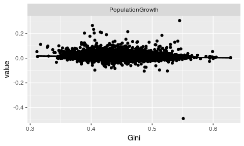
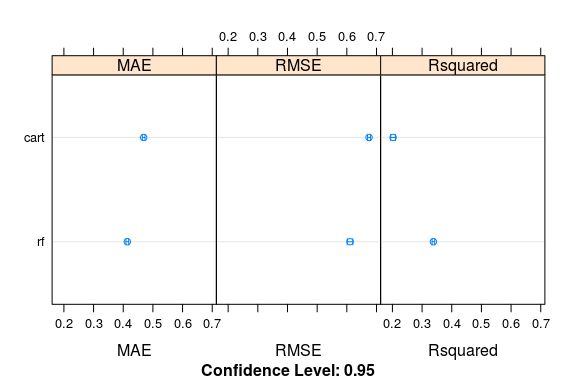
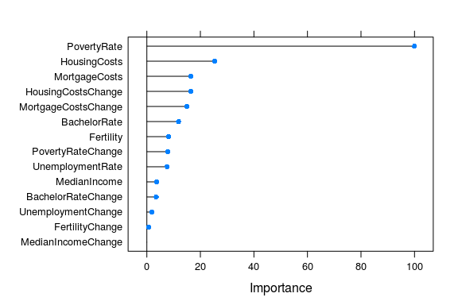
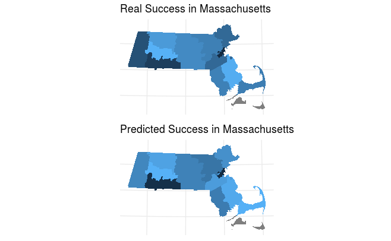
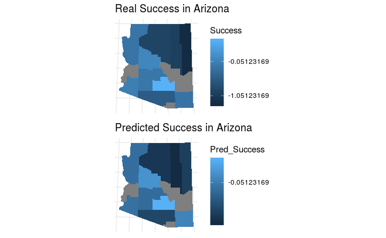

Project Goals:
========================================================

- Predict the successful American Counties
- Understand what variables makes some Counties more successful
- Create a useful model for forecasting
- Get a high adj. R squared!

Design and Approach
========================================================

Define "Successful"
- Combine population growth with gini coefficient
  
- Measure desirability of an area and its inequality

>- "Success" = 0.5*norm_populationgrowth + 0.5*norm_gini 

Population vs. Gini
========================================================

Used data from Census bureau
========================================================

- Unemployment Rate
- Median Income
- Poverty Rate
- Housing Costs
- Mortgage Costs
- Bachelor Rate
- Population
- Fertility

Methods
========================================================
We used three main algorithms:

- Linear Regression

- Regression Tree

- Random Forest

Methods cont'd
========================================================
 - Of the three, Random Forest performed best.

 - However, it still had an adjusted R-squared of ~33.78%

*parameters: 10-fold mtry, splitrule = extratrees, 
minimum node size  = 1

Results
========================================================
 - The Poverty rate was (by far) the strongest predictor for "Success"
  - Mortgage and Housing Costs were the two next most significant
  
  
Results Graphically
========================================================
- Our predicted was not (too) far from the actual.

Results cont'd
========================================================

- Note that there were some missing observations, so some counties are gray

Conclusions
========================================================
- Our model explains very little of the deviation in our output.

- However, our finding that the Poverty Rate has an outsize
  effect on our output is significant.
  
- We can further explore other variables that could be correlated to "Success" (weather? crime?)

- We could also explore how the variables we studied interact with the Poverty rate. 

- We could also forecast the variables we have and predict the "future" success of American counties.
